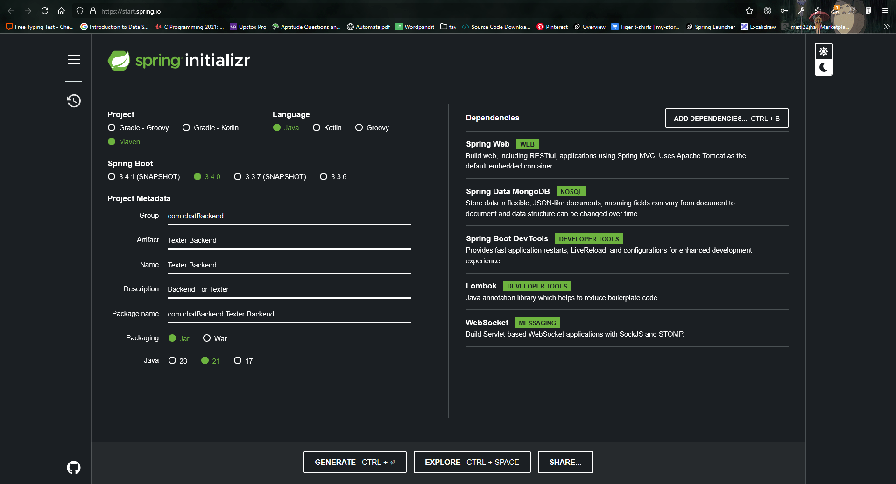
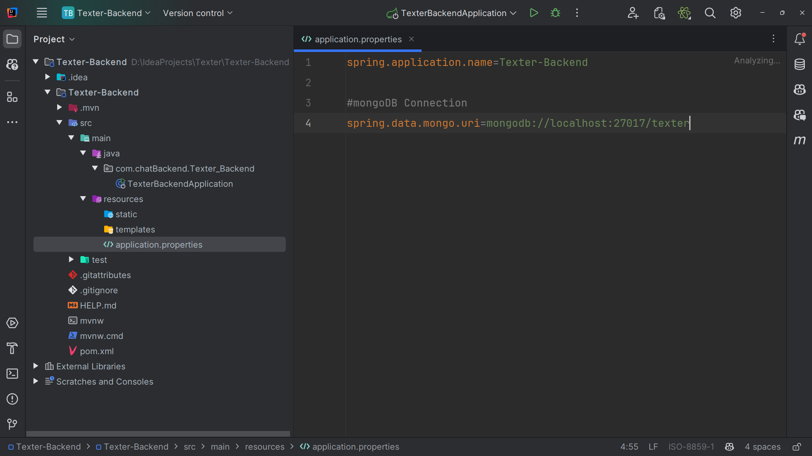
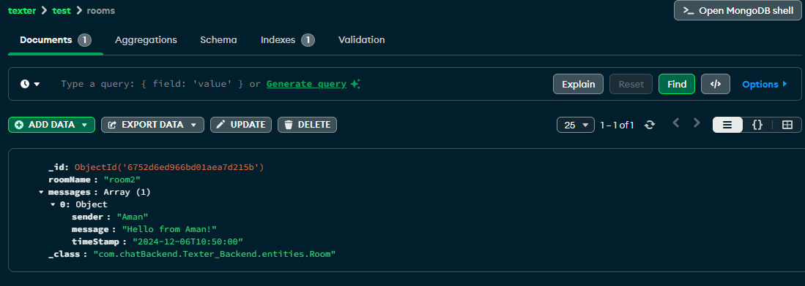

# Texter Backend

## Description
This project is a Spring Boot application built with Maven. It serves as a backend for creating RESTful web services using Java , Spring Boot , websockets for a RealTime Room Based Chat App.

## Prerequisites
- Java 11 or higher
- Maven 3.6.0 or higher

## Getting Started

### Clone the repository
```sh
git clone <https://github.com/anuragjh/Texter-Backend.git>
cd <Texter-Backend>
```

### SpringIo Dependencies and Plugins
- Spring Boot Starter Web
- Spring Boot Starter Data MongoDB
- lombok
- Spring Boot Starter Test
- Spring Boot DevTools
- Spring Boot Starter Websocket




### MongoDB Setup In Application Properties


### Entities

#### Room
- **Class Name**: `Room`
- **Fields**:
  - `String id`
  - `String roomName`
  - `List<Message> messages`

#### Message
- **Class Name**: `Message`
- **Fields**:
  - `String id`
  - `String content`
  - `String sender`
  - `Date timestamp`

### Repositories

#### Room Repository
- **Interface Name**: `roomRepo`
- **Methods**:
  - `Room findByRoomName(String roomName)`

#### Message Repository
- **Interface Name**: `messageRepo`
- **Methods**:
  - `List<Message> findByRoomId(String roomId)`

### Services

#### Room Services
- **Class Name**: `roomServices`
- **Methods**:
  - `ResponseEntity<?> createRoom(String roomName)`
  - `ResponseEntity<?> getRoom(String roomId)`
  - `ResponseEntity<?> getMessages(String roomId)`

#### Message Services
- **Class Name**: `messageServices`
- **Methods**:
  - `ResponseEntity<?> createMessage(String roomId, Message message)`
  - `ResponseEntity<?> getMessages(String roomId)`

### Controllers

#### Room Controller
- **Class Name**: `roomController`
- **Endpoints**:
  - `POST /api/v1/texter/rooms/createRoom`
  - `GET /api/v1/texter/rooms/{roomId}`
  - `GET /api/v1/texter/rooms/{roomId}/messages`

#### Message Controller
- **Class Name**: `messageController`
- **Endpoints**:
  - `POST /api/v1/texter/rooms/{roomId}/messages`
  - `GET /api/v1/texter/rooms/{roomId}/messages`

### MongoDB Demo With Room Controllers(API's)

